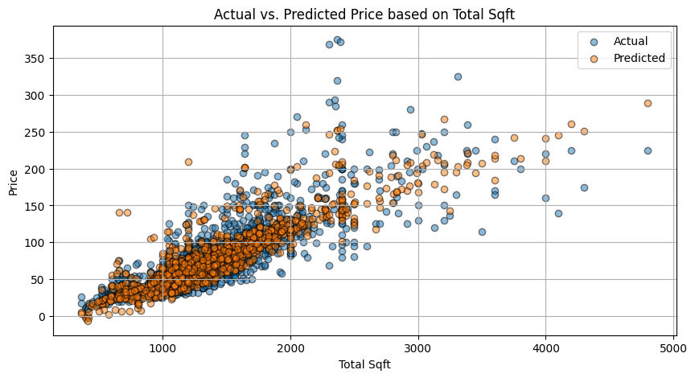
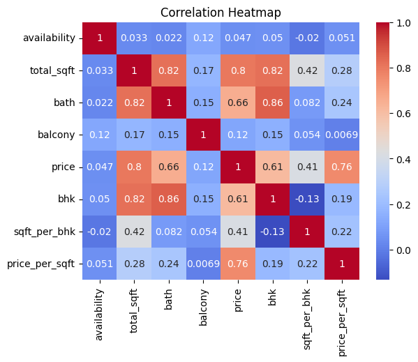

# Bengaluru House Price Prediction using Linear Regression

**An End-to-End Machine Learning Project**

[](https://www.python.org/)

[](https://scikit-learn.org/)
[](https://opensource.org/licenses/MIT)
[](https://jupyter.org/)

---

## 🏡 Project Overview: Bengaluru House Price Prediction

This machine learning project develops a `Linear Regression model` to accurately predict residential property prices in *Bengaluru, India.*

Real estate data often contains noise and significant outliers (e.g., abnormally high number of bedrooms for a small area). A central focus of this project is on meticulous *Data Cleaning*, *Outlier Removal*, and *Feature Engineering* to ensure the model provides logical and reliable predictions.

### Key components of the workflow demonstrated:

- **Exploratory Data Analysis (EDA):** Understanding data distributions, patterns, and relationships.
- **Data Cleaning & Preprocessing:** Handling missing values and ensuring data quality.
- **Outlier Detection & Removal:** Implementing techniques to filter unreasonable data points.
- **Feature Engineering:** Creating impactful derived features (e.g., sqft_per_bhk, price_per_sqft).
- **Model Building & Evaluation:** Implementing the Linear Regression model using scikit-learn and assessing performance using metrics like R².

The final model, built on carefully processed data, achieved `over 80% R² accuracy` in predicting house prices based on location, square footage, bathroom count, and BHK (Bedroom, Hall, Kitchen).

---

## 📈 Model Performance & Key Results

This section summarizes the performance of the Linear Regression model, evaluated using **5-fold cross-validation** for robust estimation.

### Key Metrics (5-Fold Cross-Validation)

The model demonstrates strong predictive power, as indicated by the following metrics:

| Metric              | Value          | Description                              |
|---------------------|:--------------:|------------------------------------------|
| Mean R² Score       | 0.81           | Good explanatory power                   |
| Mean RMSE           | ~19.61         | Average prediction error (in Lakhs)      |
| Mean MAE            | ~12.92         | Average absolute error                   |
| Mean MAPE           | ~17.79%        | Mean absolute percentage error           |

### Visual Highlights

1. **Actual vs Predicted Prices**

The scatter plot below compares the actual house prices against the model's predictions.



*Strong alignment between actual and predicted values is observed, demonstrating the model's effectiveness in capturing the general price trend across different property sizes.*

2. **Feature Correlation Analysis**

The heatmap illustrates the relationships between the processed numeric features.



**Key Insights:**

- **total_sqft** shows the strongest positive correlation with **price**, `(~0.8)`, confirming its role as the most important numeric predictor.
- **bhk** also shows a good positive correlation with **price**.
- There is high `collinearity` between **bath** and **bhk** `(~0.9)`.
- Features like **availability** and **balcony** show `weak correlation` with **price**, suggesting they are less impactful predictors in this linear model.
- The categorical features **location** and **area_type** (not shown in the numeric heatmap) are also identified as important predictors.

---

## 📂 Repository Structure

```
bengaluru-house-price-prediction/
├── data/
│   └── raw/
│       └── Bengaluru_House_Data.csv          # Original dataset
├── notebook/
│   └── bengaluru_house_price_prediction.ipynb # Main analysis notebook
├── figures/
│   ├── actual_vs_predicted.png                       # Model performance visualization
│   ├── price_per_sqft_by_location_outliers.png       # Before cleaning outliers
│   ├── ...
│   └── correlation_heatmap.png                       # Feature correlation analysis
├── requirements.txt                           # Python dependencies
├── .gitignore                                # Git ignore file
├── LICENSE                                    # MIT License
└── README.md                                  # Project documentation
```

---

## 💻 How to Run Locally

This project can be run using *Jupyter Notebook*, *Jupyter Lab*, or *VS Code*. All required data is included in `data/raw/` and no external downloads are necessary.

### Steps to Run:

1. **Clone the repository:**
```bash
git clone https://github.com/dlheghend/bengaluru-house-price-prediction.git
cd bengaluru-house-price-prediction
```

2 **Install dependencies:**
```bash
pip install -r requirements.txt
```
Alternatively, you can install the main packages manually: 
```bash
pip install pandas numpy matplotlib seaborn scikit-learn
```
3. **Launch the Notebook:**
```bash
jupyter notebook notebook/bengaluru_house_price_prediction.ipynb
```
The notebook will automatically load the dataset from `data/raw/Bengaluru_House_Data.csv`

---

## 💾 Dataset

- **Source:** [Kaggle - Bengaluru House Price Data](https://www.kaggle.com/datasets/amitabhajoy/bengaluru-house-price-data)
- **Records:** 13,320 
- **Features:** 9 columns (area_type, availability, location, size, total_sqft, bath, balcony, price, society)
- **Target Variable:** Price (in lakhs INR)
- **Location:** `data/raw/Bengaluru_House_Data.csv`

---

## 👤 Author

**Douglas, Unyime-Abasi A.**

- GitHub: [@dlheghend](https://github.com/dlheghend)
- LinkedIn: [Unyime-Abasi Douglas](https://www.linkedin.com/in/unyimeabasi-douglas)
- Email: fravicdouglas@gmail.com

> *If you found this project helpful, please consider giving it a star! 🌟*
> 
> *Feedback and suggestions are always welcome. 🤗*

---
